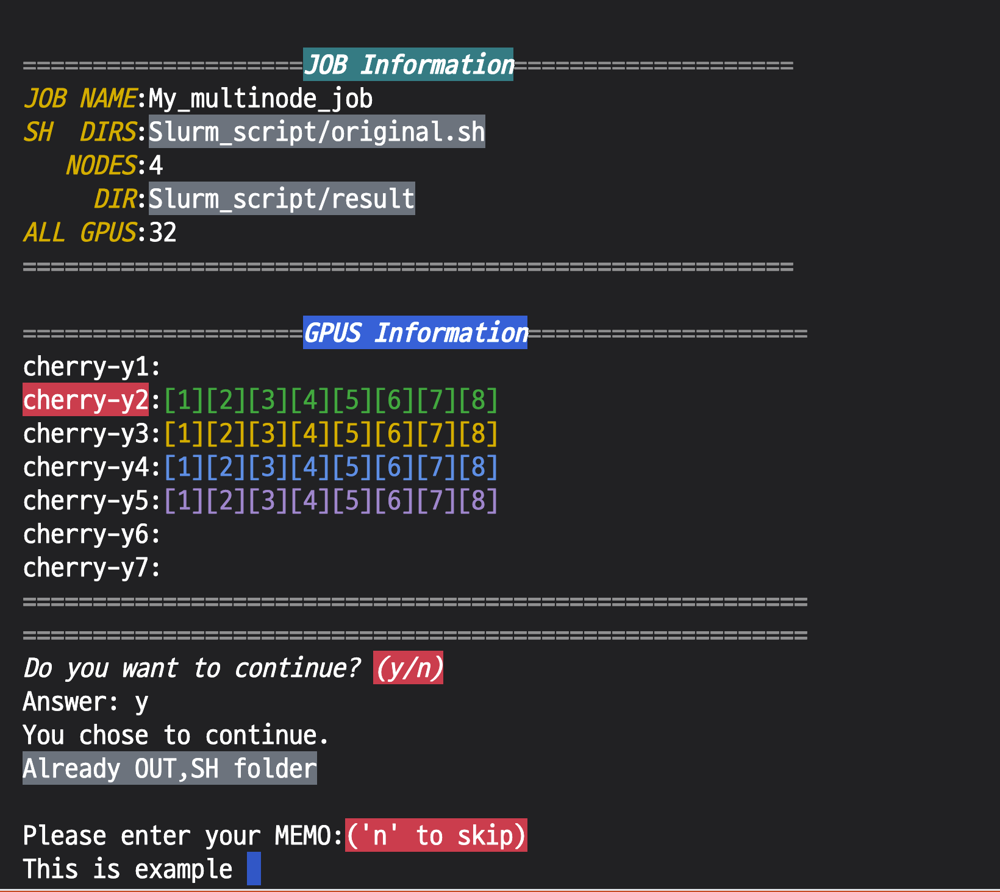

<!-- # Slurm_MultiNode
This helps you to submit job with multinode &amp; multgpu in Slurm in Torchrun<br>
The Slurm has multinode function that can help you to submit multi job by using like "-N 2","ntasks per job.." 
But, this repo is made for you that cannot use slurm default funtion  
********

<br>

## Checking my NODE can Socket
[Check_socket.md](Check_socket/README.md)

## Multinode slurm job
[Slurm_script.md](Slurm_script/README.md)
## Enviroment
#### Slurm 
Version: 21.08.8-2

#### Pytorch
Recommend 1.8 >

#### Ubuntu
Description:   Ubuntu 20.04.5 LTS
Release:       20.04

<br>
<br>

## **NCCL Setting**
### Error Issues 
>NCCL WARN Bootstrap : no socket interface found
```
Setting appropriate Socket Name
```
<br>
<br>

****
### If you want to use distributed launch, Set **"appropriate interface"**

### You can check your environment by ifconfig for example.

```sh
$ ifconfig 
```
or
```sh
$ /sbin/ifconfig -a
```
****
### ifconfig Example
```txt
enp28s0f1: flags=4163<UP,BROADCAST,RUNNING,MULTICAST>  mtu 1500
        inet <inet ip>  netmask 255.255.255.0  broadcast <broadcast add>
        inet6 fe80::a236:****:****:****  prefixlen 64  scopeid 0x20<link>
        ether **:36:9f:**:**:**  txqueuelen 1000  (Ethernet)
        RX packets 16632361209  bytes 24172178960947 (24.1 TB)
        RX errors 0  dropped 43641438  overruns 0  frame 0
        TX packets 16585505941  bytes 24290665224417 (24.2 TB)
        TX errors 0  dropped 0 overruns 0  carrier 0  collisions 0
```
## It's best to choose Etherne Interface name that have **inet6, broadcast**
### This Socket name is used later , check your Interface name
****

<br>
<br>


## **References**
1. ### [Nvidia Environment Variables Official Docs](https://docs.nvidia.com/deeplearning/nccl/user-guide/docs/env.html)
###
2. ### [Linux Commands about Net interface](https://www.cyberciti.biz/faq/linux-list-network-interfaces-names-command/) -->
# Slurm MultiNode

This repository facilitates job submission with multi-node and multi-GPU configurations in Slurm using Torchrun.

# Overview
This repository provides scripts that are helpful when using multinode with PyTorch DDP module in Slurm. It consists of master.sh and original.sh, where master.sh submits original.sh for each node. The example involves using a total of 32 GPUs across 4 nodes, each with 8 GPUs. The scripts offer color coding for sanity checks and also include a memo feature.<br>
<br>



# Contents

- [Checking Node Socket Information](Check_socket/README.md)
- [Multi-Node Slurm Job](Slurm_script/README.md)

# Environment

- **Slurm Version:** 21.08.8-2
- **Pytorch Version:** Recommended 1.8 and above
- **Ubuntu Version:** 20.04.5 LTS

# NCCL Setting

### Handling "NCCL WARN Bootstrap: no socket interface found" Error

Ensure proper socket naming by following the instructions provided in the repository.

### Setting the Appropriate Interface for Distributed Launch

If you intend to use distributed launch, set the "appropriate interface" for your environment. You can check your available interfaces using the following commands:

```sh
$ ifconfig
or
$ /sbin/ifconfig -a
```
The chosen Ethernet Interface name should have both inet6 and broadcast properties. This socket name will be used later, so carefully note your interface name.

### Examples of Interface Information (ifconfig)
```sh
en***: flags=****<UP,BROADCAST,RUNNING,MULTICAST>  mtu 1500
        inet <inet ip>  netmask 255.255.255.0  broadcast <broadcast add>
        inet6 f****::****:****:****:****  prefixlen 64  scopeid 0x20<link>
        ether **:36:**:**:**:**  txqueuelen 1000  (Ethernet)
        RX packets 16632361209  bytes 24172178960947 (24.1 TB)
        RX errors 0  dropped 43641438  overruns 0  frame 0
        TX packets 16585505941  bytes 24290665224417 (24.2 TB)
        TX errors 0  dropped 0 overruns 0  carrier 0  collisions 0
```
Choose the Ethernet Interface name with inet6 and broadcast properties for later use.
### To set the NCCL_SOCKET_IFNAME, use the chosen Ethernet interface name. 
#### For example:
```sh
export NCCL_SOCKET_IFNAME=en***
```


# References

1. [Nvidia Environment Variables Official Docs](https://docs.nvidia.com/deeplearning/nccl/user-guide/docs/env.html)
2. [Linux Commands about Net interface](https://www.cyberciti.biz/faq/linux-list-network-interfaces-names-command/)

Feel free to enhance the design for improved clarity and aesthetics.
